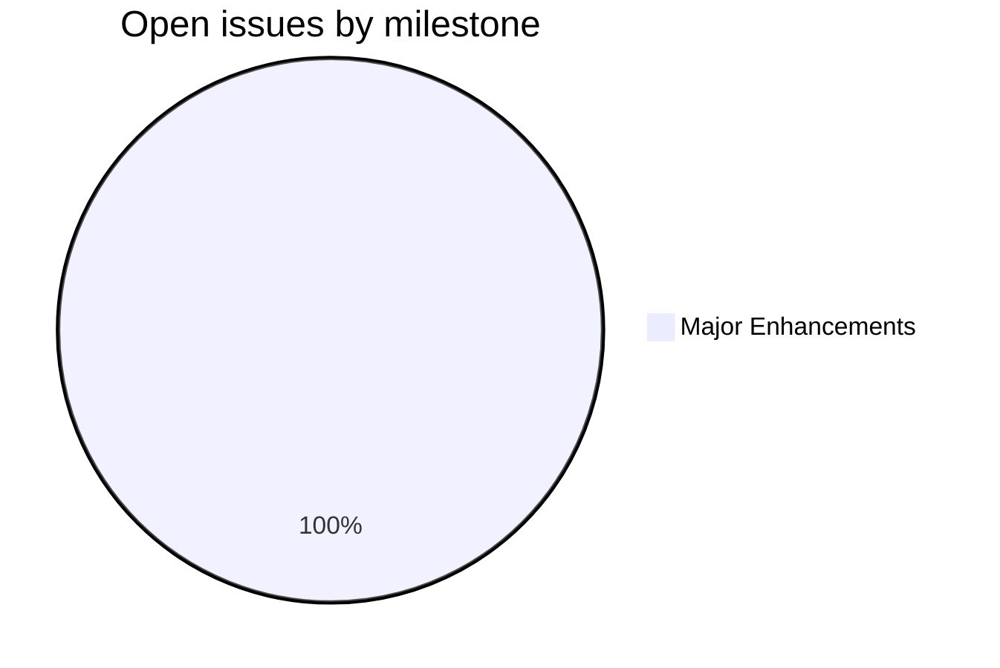
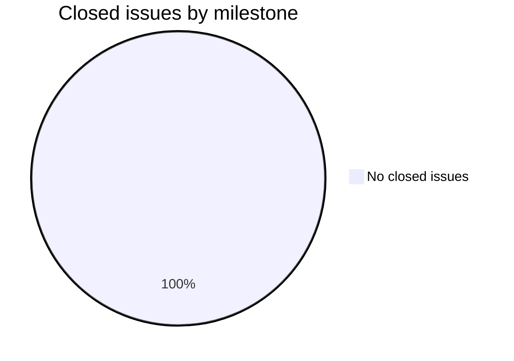
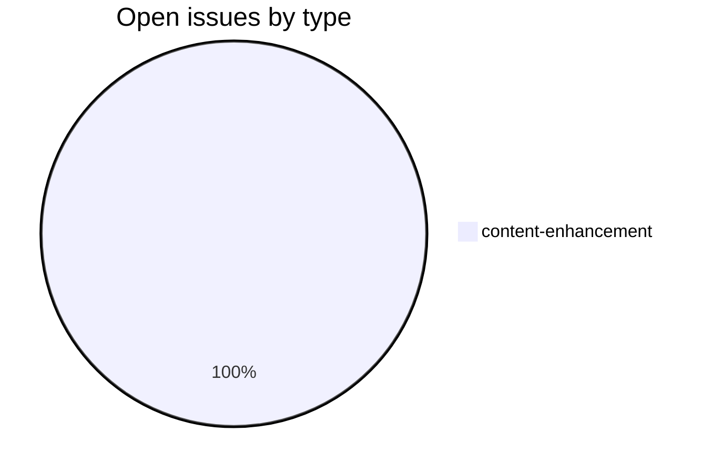
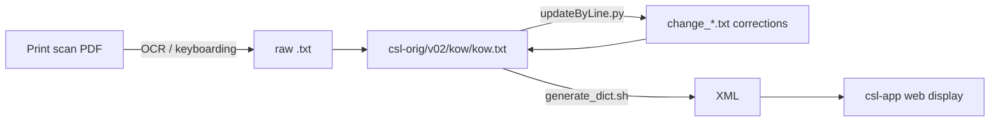

# KOW — Kossowich Sanskrit-Russian Dictionary

_Created: 21-02-2026 · Last updated: 05-07-2026_

**KOW** is the corrections and build repository for the Cologne Digital Sanskrit Dictionaries digitization of Kaëtan Kossovich's *Sanskrito-russkiy slovar* (Sanskrit-Russian Dictionary, 1854). It is part of the [sanskrit-lexicon](https://github.com/sanskrit-lexicon) organisation at the University of Cologne.

The dictionary contains approximately 13,488 entries across 360 pages in two columns and is one of the earliest Sanskrit-Russian lexicons. Corrections are never made directly to source files — they are expressed as change files applied by scripts.

## Contents

| Path | Description |
|---|---|
| `csl-orig/v02/kow/kow.txt` | Primary digitized source (sibling repo `csl-orig`) |
| `csl-pywork/v02/` | Build scripts, XML generation, validation |
| `KOWScan/` | PNG page scans of the printed dictionary |
| `CLAUDE.md` | Developer notes, data format reference, issue conventions |
| `CITATION.cff` | Machine-readable academic citation metadata |

## Timeline

| Period | Work |
|---|---|
| 1854 | Original printed edition by Kaëtan Kossovich, St. Petersburg |
| 2020+ | Initial digitization and scan repository (`KOWScan`) created |
| 2025 | Repository established at `sanskrit-lexicon/KOW`; source file ingested |
| 2026 | Issue triage and taxonomy applied; CLAUDE.md, CITATION.cff added |

## Projects & Milestones

| Milestone | Open | Closed |
|---|---|---|
| Dictionary to Book | 0 | 0 |
| Digitization Quality | 0 | 0 |
| Structured Data | 0 | 0 |
| Major Enhancements | 1 | 0 |





## Issue Typology

### Open issues

| # | Title | Type | Severity | Milestone |
|---|---|---|---|---|
| [#1](https://github.com/sanskrit-lexicon/KOW/issues/1) | Kossowich Sanskrit-Russian Dictionary: Source Files | content-enhancement | medium | Major Enhancements |



### Solved issues

No closed issues yet.

## Labels

### Type labels

| Label | Color | Description |
|---|---|---|
| `link-target` | `#0075ca` | Building click-throughs from `<ls>` abbreviations to scanned PDF pages |
| `link-splitting` | `#0075ca` | Splitting combined `SOURCE N,N` refs into individual per-page links |
| `markup` | `#0075ca` | Normalising XML tag content (`<ls>`, `<lex>`, `<ab>`, etc.) |
| `text-correction` | `#0075ca` | Corrections to Russian definitions or Sanskrit headwords |
| `content-enhancement` | `#0075ca` | New material, display upgrades, structural additions beyond correction |
| `encoding` | `#0075ca` | SLP1/AS/IAST transcoding, character rendering, hyphen/dash normalisation |
| `scan-quality` | `#0075ca` | Replacing blurry, skewed, or missing scan pages |
| `bug` | `#0075ca` | Broken links, XML errors, broken download files |
| `question` | `#0075ca` | Scholarly questions requiring research before any code change |

### Severity labels

| Label | Color | Description |
|---|---|---|
| `minor` | `#e4e669` | Targeted, self-contained fix |
| `medium` | `#fbca04` | Standard unit of work — one index, a batch of corrections |
| `hard` | `#d93f0b` | Large effort spanning many sources, files, or dictionaries |

## Usage example

`kow.txt` is not in this repo — it lives in the sibling `csl-orig` repo (see [Dependencies in CLAUDE.md](CLAUDE.md) for the exact path). [CLAUDE.md § Annotated Example Entry](CLAUDE.md) documents the format's own reference entry (entry 1, headword *a*, negation-prefix sense):

```
<L>1<pc>001,1<k1>a<k2>a<e>1
{#a#} — prefix of negation or privation (like Gr. ),
corresponding to Goth. , Engl.  etc.
<LEND>
```

To correct the etymological gloss with the org's `updateByLine.py` workflow, a change file addresses print line 1 with the old/new text pair:

```
1 old {#a#} — prefix of negation or privation (like Gr. ),
1 new {#a#} — prefix of negation or privation (a privativum, cf. Gr. ),
```

```sh
python updateByLine.py kow.txt change_kow_N.txt kow_corrected.txt
```

## How it works



## Encoding

- UTF-8 NFC throughout.
- Sanskrit text in SLP1 transliteration, wrapped in `{#...#}`.
- Display layer uses IAST (ISO 15919) and Devanagari, generated via `transcoder/`.
- Russian definitions stored as UTF-8 Cyrillic.
- Round-trip SLP1 ↔ IAST ↔ Devanagari verified for all entries; exceptions tracked under label `encoding`.

## Source

- **Author**: Kossovich, Kaëtan (Коссович, Каэтан Аетанович, 1815–1883)
- **Title**: *Sanskrito-russkiy slovar* (Санскрито-русский словарь)
- **Publisher**: St. Petersburg
- **Year**: 1854
- **Print pages**: 360 (2 columns)
- **Entries**: ~13,488
- **WorldCat**: [1048662463](https://search.worldcat.org/title/1048662463)
- **Scans**: [Google Drive PNG archive](https://drive.google.com/file/d/1JKJFiB3sl6dmd3jPnkRx68ZUGtqY9qlN/view?usp=drive_fs)
- **First digitisation**: Cologne Digital Sanskrit Dictionaries, 2020+

## Contributors

- [@artanat](https://github.com/artanat) — initial digitization
- [@funderburkjim](https://github.com/funderburkjim) — Cologne project maintainer
- [@gasyoun](https://github.com/gasyoun) — project coordination
- [Cologne Digital Sanskrit Dictionaries contributors](https://www.sanskrit-lexicon.uni-koeln.de/)

_Dr. Mārcis Gasūns_
