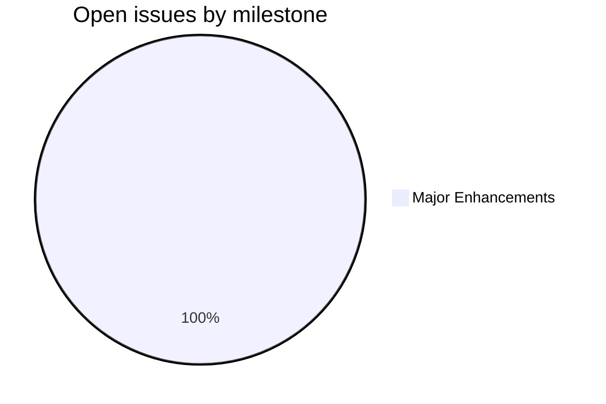
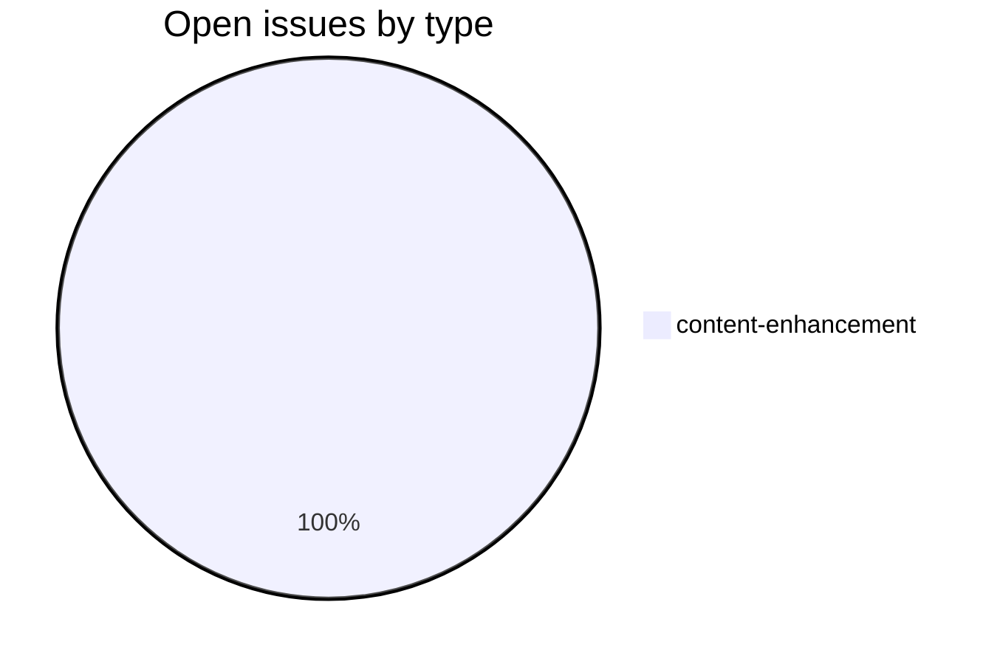
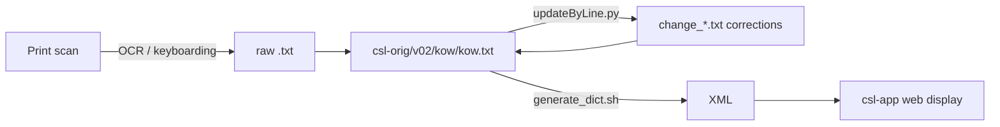

# KOW — Kossowich Sanskrit-Russian Dictionary

_Created: 21-02-2026 · Last updated: 11-07-2026_

**KOW** is the corrections-and-build repository slot for the Cologne Digital Sanskrit Dictionaries digitization of Kaëtan Kossovich's *Sanskrito-russkiy slovar* (Sanskrit-Russian Dictionary, 1854). It is part of the [sanskrit-lexicon](https://github.com/sanskrit-lexicon) organisation at the University of Cologne.

Kossovich's dictionary — an estimated ~13,488 entries across 360 pages in two columns — is one of the earliest Sanskrit-Russian lexicons. This repository is the eventual home for the digitized text and its correction pipeline.

> **Status (11-07-2026): metadata-only stub — the digitized text has not yet been delivered.** No `kow.txt` source file exists in `csl-orig` yet, and there is no scan or build tree in this repository. The paths and pipeline described below are the *intended* structure that becomes active once Cologne delivers the digitized text; they are not present today. This repository currently holds only project metadata (this README, [CLAUDE.md](https://github.com/sanskrit-lexicon/KOW/blob/main/CLAUDE.md), [CITATION.cff](https://github.com/sanskrit-lexicon/KOW/blob/main/CITATION.cff), [CHANGELOG.md](https://github.com/sanskrit-lexicon/KOW/blob/main/CHANGELOG.md), [LICENSE](https://github.com/sanskrit-lexicon/KOW/blob/main/LICENSE), and a Pages landing page).

## Current repository contents

| Path | Description |
|---|---|
| [README.md](https://github.com/sanskrit-lexicon/KOW/blob/main/README.md) | This file |
| [CLAUDE.md](https://github.com/sanskrit-lexicon/KOW/blob/main/CLAUDE.md) | Developer notes, intended data-format reference, issue conventions |
| [CITATION.cff](https://github.com/sanskrit-lexicon/KOW/blob/main/CITATION.cff) | Machine-readable academic citation metadata |
| [CHANGELOG.md](https://github.com/sanskrit-lexicon/KOW/blob/main/CHANGELOG.md) | Repository-level change log |
| [index.html](https://github.com/sanskrit-lexicon/KOW/blob/main/index.html) | GitHub Pages landing page |

## Intended structure (pending source delivery)

Once Cologne delivers the digitized text, the working pipeline follows the standard Cologne dictionary shape. None of these paths exist yet:

| Path | Role (when present) |
|---|---|
| `csl-orig/v02/kow/kow.txt` | Primary digitized source (sibling repo [`csl-orig`](https://github.com/sanskrit-lexicon/csl-orig)) — **not yet present** |
| `csl-pywork/v02/` | Build scripts, XML generation, validation (sibling repo) — **not yet present** |
| Scan archive | PNG page scans of the printed dictionary — **not yet ingested into the org** |

Corrections in the Cologne project are never made directly to source files — they are expressed as change files applied by scripts. The full correction workflow is documented canonically in [csl-corrections/docs/correction-workflow.md](https://github.com/sanskrit-lexicon/csl-corrections/blob/main/docs/correction-workflow.md); it will apply here once the source exists.

## Timeline

| Period | Work |
|---|---|
| 1854 | Original printed edition by Kaëtan Kossovich, St. Petersburg |
| 2026-02 | Repository slot established at [`sanskrit-lexicon/KOW`](https://github.com/sanskrit-lexicon/KOW) |
| 2026-05 | Metadata added ([CLAUDE.md](https://github.com/sanskrit-lexicon/KOW/blob/main/CLAUDE.md), [CITATION.cff](https://github.com/sanskrit-lexicon/KOW/blob/main/CITATION.cff)); issue taxonomy (labels, milestones) applied |
| pending | Cologne delivery of the digitized `kow.txt` source, then ingest → correction → XML build → web display |

## Projects & Milestones

Live as of 11-07-2026 (via the [GitHub milestones API](https://github.com/sanskrit-lexicon/KOW/milestones)):

| Milestone | Open | Closed |
|---|---|---|
| Dictionary to Book | 0 | 0 |
| Digitization Quality | 0 | 0 |
| Structured Data | 0 | 0 |
| Major Enhancements | 1 | 0 |

## Issue Typology

### Open issues

| # | Title | Type | Severity | Milestone |
|---|---|---|---|---|
| [#1](https://github.com/sanskrit-lexicon/KOW/issues/1) | Kossowich Sanskrit-Russian Dictionary: Source Files | content-enhancement | medium | Major Enhancements |

Issue [#1](https://github.com/sanskrit-lexicon/KOW/issues/1) tracks exactly the blocker above: obtaining the digitized source files.

### Solved issues

No closed issues yet.

## Labels

### Type labels

| Label | Color | Description |
|---|---|---|
| `link-target` | `#0075ca` | Building click-throughs from `<ls>` abbreviations to scanned pages |
| `link-splitting` | `#0075ca` | Splitting combined `SOURCE N,N` refs into individual per-page links |
| `markup` | `#0075ca` | Normalising XML tag content (`<ls>`, `<lex>`, `<ab>`, etc.) |
| `text-correction` | `#0075ca` | Corrections to Russian definitions or Sanskrit headwords |
| `content-enhancement` | `#0075ca` | New material, display upgrades, structural additions beyond correction |
| `encoding` | `#0075ca` | SLP1/AS/IAST transcoding, character rendering, hyphen/dash normalisation |
| `scan-quality` | `#0075ca` | Replacing blurry, skewed, or missing scan pages |
| `bug` | `#0075ca` | Broken links, XML errors, broken download files |
| `question` | `#0075ca` | Scholarly questions requiring research before any code change |

### Severity labels

| Label | Color | Description |
|---|---|---|
| `minor` | `#e4e669` | Targeted, self-contained fix |
| `medium` | `#fbca04` | Standard unit of work — one index, a batch of corrections |
| `hard` | `#d93f0b` | Large effort spanning many sources, files, or dictionaries |

## Intended pipeline

The standard Cologne dictionary flow, which becomes active once the source is delivered:

## Intended encoding conventions

When the text arrives it will follow the Cologne conventions:

- UTF-8 NFC throughout.
- Sanskrit text in SLP1 transliteration, wrapped in `{#...#}`.
- Display layer in IAST (ISO 15919) and Devanagari, generated via `transcoder/`.
- Russian definitions stored as UTF-8 Cyrillic.

## Source

- **Author**: Kossovich, Kaëtan (Коссович, Каэтан Аетанович, 1815–1883)
- **Title**: *Sanskrito-russkiy slovar* (Санскрито-русский словарь)
- **Publisher**: St. Petersburg
- **Year**: 1854
- **Print pages**: 360 (2 columns)
- **Estimated entries**: ~13,488
- **WorldCat**: [1048662463](https://search.worldcat.org/title/1048662463)

## Contributors

- [@funderburkjim](https://github.com/funderburkjim) — Cologne project maintainer
- [@gasyoun](https://github.com/gasyoun) — project coordination
- [Cologne Digital Sanskrit Dictionaries contributors](https://www.sanskrit-lexicon.uni-koeln.de/)

_Dr. Mārcis Gasūns_
